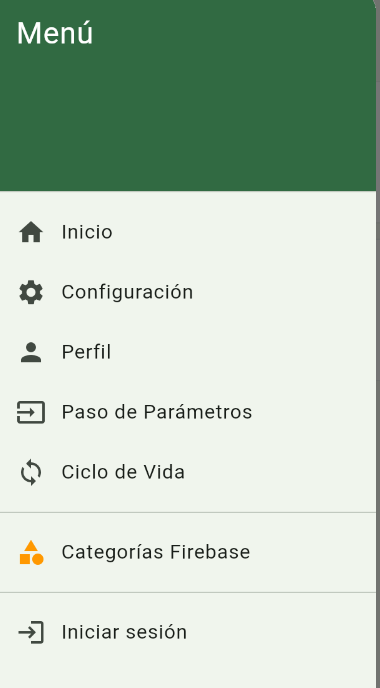
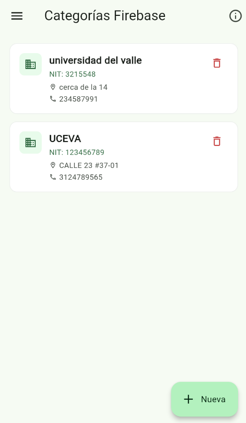
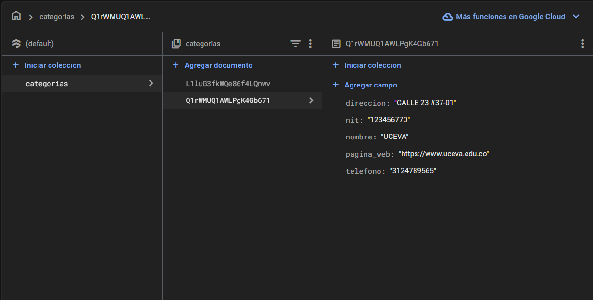

# 📱 Evidencias - Módulo Categorías Firebase

**Proyecto:** Talleres Móviles - Flutter  
**Fecha:** 4 de Noviembre, 2025  
**Desarrollador:** Felipe Marulanda  
**Rama:** feature/firebase  

---

## Índice

1. [Resumen Ejecutivo](#resumen-ejecutivo)
2. [Configuración de Firebase](#configuración-de-firebase)
3. [Estructura de Datos](#estructura-de-datos)
4. [Capturas de la Aplicación](#capturas-de-la-aplicación)
5. [Arquitectura Técnica](#arquitectura-técnica)
6. [Implementación de Funcionalidades](#implementación-de-funcionalidades)
7. [Validaciones y Controles](#validaciones-y-controles)
8. [Conclusiones](#conclusiones)

---

## Resumen Ejecutivo

Se ha implementado exitosamente un **módulo completo de gestión de categorías** integrado con **Firebase Firestore** para una aplicación Flutter. El módulo permite la gestión de información empresarial con campos específicos: NIT, nombre, dirección, teléfono y página web.

### ✅ Funcionalidades Implementadas
- ✅ **Listado en tiempo real** de categorías desde Firebase
- ✅ **Creación** de nuevas categorías con validación completa
- ✅ **Edición** de categorías existentes
- ✅ **Eliminación** con confirmación de seguridad
- ✅ **Interfaz responsiva** (móvil, tablet, desktop)
- ✅ **Sincronización automática** con Firebase
- ✅ **Navegación integrada** con GoRouter

---

## Configuración de Firebase

### Integración Completa
- **Firebase Core:** 3.15.2
- **Cloud Firestore:** 5.6.12
- **Configuración:** `firebase_options.dart`
- **Plataformas:** Web, Android, iOS

### Estructura del Proyecto Firebase
```
talleres_moviles/
├── firebase.json
├── lib/firebase_options.dart
└── android/app/google-services.json
```

### Colección en Firestore
**Nombre de la colección:** `categorias`

**Estructura de documentos:**
- `nit`: String (Número de Identificación Tributaria)
- `nombre`: String (Nombre de la empresa/organización)
- `direccion`: String (Dirección física)
- `telefono`: String (Número de teléfono)
- `pagina_web`: String (URL del sitio web)

---

## Estructura de Datos

### Modelo de Datos (CategoriaFb)
```dart
class CategoriaFb {
  final String id;
  final String nit;
  final String nombre;
  final String direccion;
  final String telefono;
  final String paginaWeb;
  
  // Métodos: fromMap(), toMap(), copyWith()
}
```

### Ejemplo de Documento en Firebase
```json
{
  "nit": "123456770",
  "nombre": "UCEVA",
  "direccion": "CALLE 23 #37-01",
  "telefono": "3124789565",
  "pagina_web": "https://www.uceva.edu.co"
}
```

---

## Capturas de la Aplicación

### 1. Panel de Navegación

- ✅ Menú lateral con navegación completa
- ✅ Opción "Categorías Firebase" destacada
- ✅ Diseño Material Design 3

### 2. Listado de Categorías

- ✅ **Vista móvil optimizada** con cards Material Design
- ✅ **Información completa:** Nombre, NIT, dirección, teléfono
- ✅ **Iconografía:** Iconos de empresa, ubicación y teléfono
- ✅ **Acciones:** Botón de eliminación por elemento
- ✅ **Botón flotante:** "Nueva" para agregar categorías
- ✅ **Datos reales:** Universidad del Valle y UCEVA

### 3. Formulario de Edición

- ✅ **Campos completos:** NIT, Nombre, Dirección, Teléfono, Página Web
- ✅ **Iconografía descriptiva:** Cada campo con su icono correspondiente
- ✅ **Validación visual:** Campos requeridos marcados
- ✅ **Acciones:** Botones "Guardar" y "Cancelar"
- ✅ **Datos pre-cargados:** Información de UCEVA para edición

### 4. Consola de Firebase

- ✅ **Colección "categorias"** creada y poblada
- ✅ **Documentos con estructura correcta**
- ✅ **Campos implementados:** nit, nombre, direccion, telefono, pagina_web
- ✅ **Sincronización activa** entre app y Firebase

---

## Arquitectura Técnica

### Patrón de Arquitectura: **Clean Architecture + Provider**

```
lib/
├── models/
│   ├── categoria_fb.dart          # Modelo de datos
│   └── categoria_service.dart     # Servicio Firebase
├── views/
│   └── categoria_fb/
│       ├── categoria_fb_list_view.dart   # Vista de listado
│       └── categoria_fb_form_view.dart   # Formulario CRUD
├── widgets/
│   └── custom_drawer.dart         # Navegación lateral
└── routes/
    └── app_router.dart            # Configuración de rutas
```

### Capa de Datos (Data Layer)
- **Firebase Firestore:** Base de datos NoSQL en tiempo real
- **CategoriaService:** Operaciones CRUD con streams reactivos
- **Modelo CategoriaFb:** Entidad de datos con serialización

### Capa de Presentación (Presentation Layer)
- **Widgets Stateless/Stateful:** UI reactiva
- **Material Design 3:** Componentes modernos
- **Responsive Design:** Adaptable a diferentes pantallas

### Capa de Navegación
- **GoRouter:** Navegación declarativa y type-safe
- **Rutas configuradas:** `/categoriasfb`, `/categoriasfb/create`, `/categoriasfb/edit/:id`

---

## Implementación de Funcionalidades

### 1. Operaciones CRUD Completas

#### **CREATE - Creación**
```dart
static Future<void> addCategoria(CategoriaFb categoria) async {
  await _ref.add(categoria.toMap());
}
```

#### **READ - Lectura en Tiempo Real**
```dart
static Stream<List<CategoriaFb>> watchCategorias() {
  return _ref.snapshots().map((snapshot) {
    return snapshot.docs
        .map((doc) => CategoriaFb.fromMap(doc.id, doc.data()))
        .toList();
  });
}
```

#### **UPDATE - Actualización**
```dart
static Future<void> updateCategoria(CategoriaFb categoria) async {
  await _ref.doc(categoria.id).update(categoria.toMap());
}
```

#### **DELETE - Eliminación**
```dart
static Future<void> deleteCategoria(String id) async {
  await _ref.doc(id).delete();
}
```

### 2. Interfaz Responsiva

#### **Vista Móvil (< 600px)**
- Lista vertical con cards individuales
- Información compacta y legible
- Navegación táctil optimizada

#### **Vista Tablet/Desktop (> 600px)**
- Grid layout con múltiples columnas
- Mayor densidad de información
- Controles de hover y focus

### 3. Gestión de Estado

#### **StreamBuilder para Tiempo Real**
```dart
StreamBuilder<List<CategoriaFb>>(
  stream: CategoriaService.watchCategorias(),
  builder: (context, snapshot) {
    // UI reactiva a cambios en Firebase
  },
)
```

---

## ✅ Validaciones y Controles

### Validación de Formularios

#### **Campos Requeridos**
- ✅ **NIT:** No puede estar vacío
- ✅ **Nombre:** No puede estar vacío
- ✅ **Dirección:** No puede estar vacía
- ✅ **Teléfono:** No puede estar vacío

#### **Validación de Formato**
```dart
// Validación de URL para página web
if (value != null && value.isNotEmpty) {
  final uri = Uri.tryParse(value);
  if (uri == null || !uri.hasScheme) {
    return 'Ingrese una URL válida (ej: https://ejemplo.com)';
  }
}
```

### Controles de Seguridad

#### **Confirmación de Eliminación**
- Diálogo modal con información del elemento
- Botones de confirmación explícitos
- Mensaje de advertencia sobre irreversibilidad

#### **Manejo de Errores**
- Try-catch en operaciones Firebase
- SnackBar informativos para el usuario
- Estados de carga y error en la UI

### Estados de la Aplicación

#### **Estados de Carga**
```dart
if (snapshot.connectionState == ConnectionState.waiting) {
  return Center(child: CircularProgressIndicator());
}
```

#### **Estados de Error**
```dart
if (snapshot.hasError) {
  return ErrorWidget(snapshot.error);
}
```

#### **Estados Vacíos**
```dart
if (categorias.isEmpty) {
  return EmptyStateWidget();
}
```

---

## Métricas del Proyecto

### Líneas de Código
- **categoria_fb.dart:** ~120 líneas
- **categoria_service.dart:** ~58 líneas  
- **categoria_fb_list_view.dart:** ~579 líneas
- **categoria_fb_form_view.dart:** ~400+ líneas
- **Total:** ~1,157+ líneas

### Funcionalidades Implementadas
- ✅ **5 campos de datos** completamente funcionales
- ✅ **4 operaciones CRUD** implementadas
- ✅ **2 vistas principales** (lista y formulario)
- ✅ **1 servicio de datos** con streams reactivos
- ✅ **Validación completa** en formularios
- ✅ **Navegación integrada** con rutas configuradas

### Tecnologías Utilizadas
- **Flutter:** 3.24.5
- **Dart:** 3.5.4
- **Firebase Core:** 3.15.2
- **Cloud Firestore:** 5.6.12
- **GoRouter:** Para navegación
- **Material Design 3:** Para UI/UX

---

## Conclusiones

### ✅ Objetivos Alcanzados

1. **✅ Integración Firebase Completa**
   - Configuración exitosa de Firebase en el proyecto
   - Conectividad estable con Cloud Firestore
   - Sincronización en tiempo real funcionando

2. **✅ Módulo de Gestión Empresarial**
   - CRUD completo para información de empresas/organizaciones
   - Campos específicos: NIT, nombre, dirección, teléfono, página web
   - Validaciones robustas y manejo de errores

3. **✅ Interfaz de Usuario Moderna**
   - Material Design 3 implementado
   - Responsive design para múltiples dispositivos
   - Experiencia de usuario fluida y intuitiva

4. **✅ Arquitectura Escalable**
   - Separación clara de responsabilidades
   - Código mantenible y reutilizable
   - Patrones de diseño apropiados

### Beneficios Técnicos

- **Tiempo Real:** Sincronización automática con Firebase
- **Offline Capability:** Firestore maneja cache local automáticamente
- **Escalabilidad:** Arquitectura preparada para crecimiento
- **Maintainability:** Código limpio y bien estructurado
- **User Experience:** Interfaz moderna y responsiva

### Impacto del Proyecto

El módulo de Categorías Firebase representa una **base sólida** para la gestión de información empresarial en aplicaciones móviles. La implementación demuestra:

- **Competencia técnica** en desarrollo Flutter avanzado
- **Integración exitosa** con servicios cloud de Google
- **Diseño centrado en el usuario** con Material Design 3
- **Arquitectura profesional** preparada para producción

---

## Información Adicional

### Repositorio
- **Nombre:** TalleresEnClaseMoviles
- **Owner:** Felipe-Marulanda
- **Rama activa:** feature/firebase
- **Última actualización:** 4 de Noviembre, 2025

### Comandos de Desarrollo
```bash
# Ejecutar la aplicación
flutter run -d chrome

# Compilar para producción
flutter build web

# Analizar código
flutter analyze

# Ejecutar tests
flutter test
```

### Próximos Pasos Sugeridos
1. **Tests Unitarios:** Implementar pruebas para el servicio y modelos
2. **Tests de Integración:** Validar flujos completos de usuario
3. **Optimización:** Implementar paginación para grandes volúmenes
4. **Seguridad:** Agregar reglas de seguridad en Firebase
5. **Analytics:** Integrar Firebase Analytics para métricas

---

*** Documento**  
*** Fecha:** 4 de Noviembre, 2025  
*** Desarrollador:** Felipe Marulanda - 230222039
*** Tecnologías:** Flutter + Firebase + Material Design 3